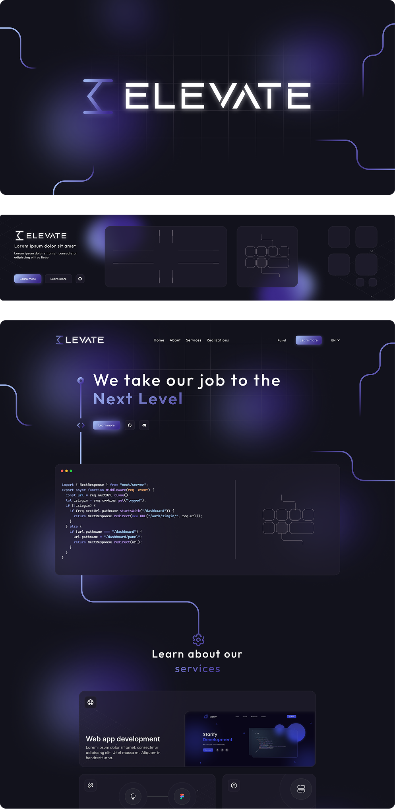

# Elevate — A Quiet Snapshot

> A small, polished Next.js site for a past project 

---

What you'll find here
- A tidy Next.js website showcasing the Elevate project: visuals, copy, and a few interactive touches.
- A preserved snapshot of design and implementation decisions — good for browsing, reference, or portfolio use.

This repository is a personal archive / demo of a former project. It is not actively maintained and is not intended for public contributions or active development. Please do not open pull requests or issues unless you are reporting something critical.

Why this exists
- To keep a clean, browsable record of the project's frontend.
- To show the visual and UX decisions made at the time.
- To provide a simple reference for design and static implementation.

Tech stack 
- Next.js (React)
- TailwindCss

Prerequisites
- Node.js (16+ recommended)
- npm, yarn, or pnpm

Local development (recommended)
1. Clone
   - git clone https://github.com/TheRoxer/elevate-web.git
   - cd elevate-web
2. Install
   - npm install
3. Run dev server
   - npm run dev
   visit http://localhost:3000

Preview production build
- Build: npm run build
- Start (production): npm run start
- This runs Next.js in production mode on port 3000 by default.

Static export (if you prefer a static snapshot)
- npm run build
- npm run export
- The exported static site will be in the out/ folder and can be served by any static host.

Environment
- If the app requires environment variables, place them in .env.local (this repo is an archive; check next.config.js or README sections in the repo for any variables).

Hosting
- Deploy easily to Vercel (recommended for Next.js) or any host that supports Node.js / static exports.

Not for contributions
- This project is preserved as-is. Forking for personal use or study is fine, but please do not send pull requests to this repository — it’s not intended to be merged or actively developed.
- If you want to reuse assets or code, fork the repo and adapt it into your own project.

Credits & contact
- Built by: TheRoxer

Enjoy browsing the snapshot. ✨
